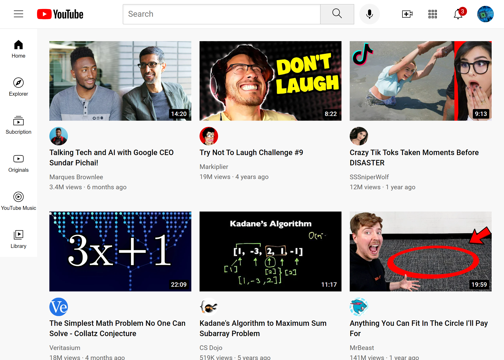
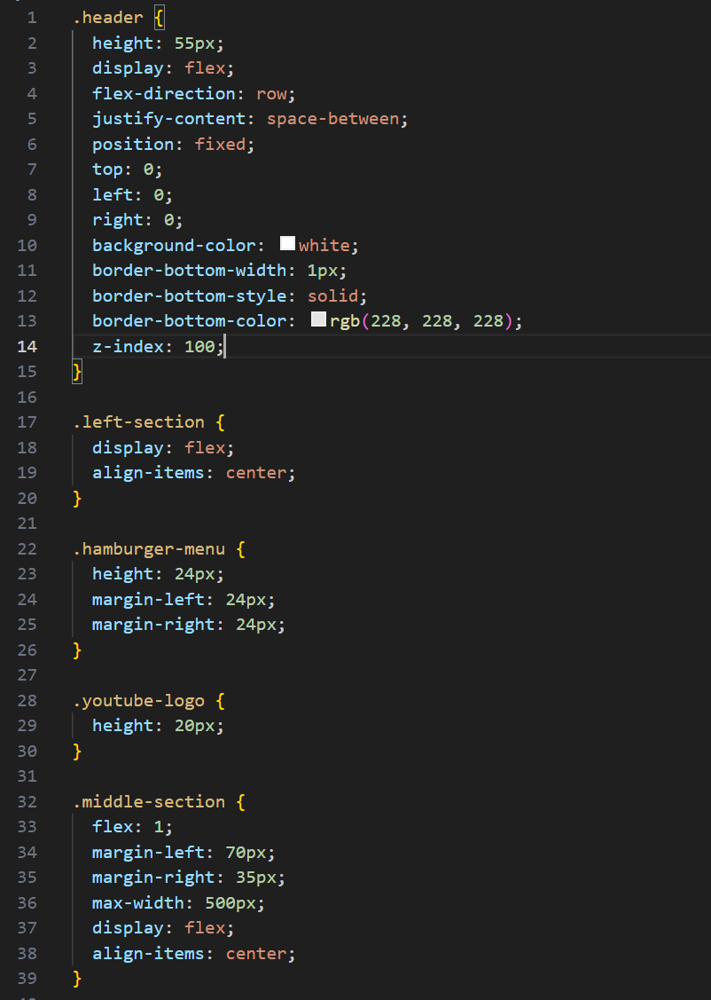
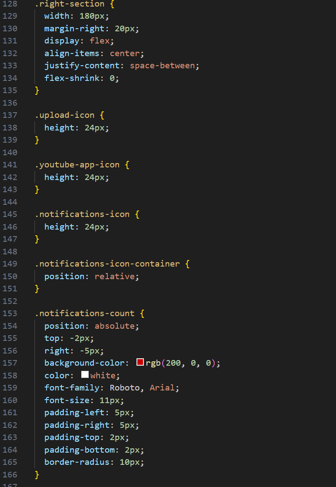
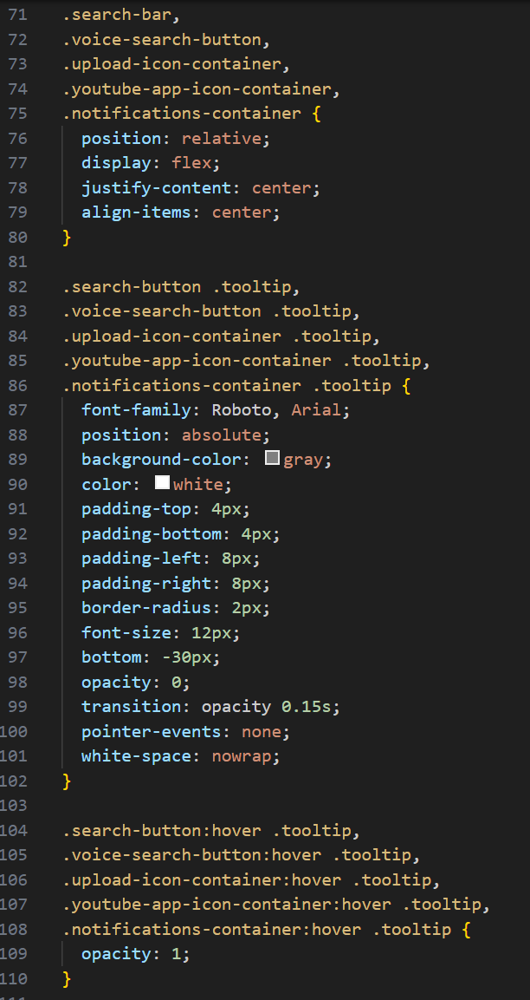
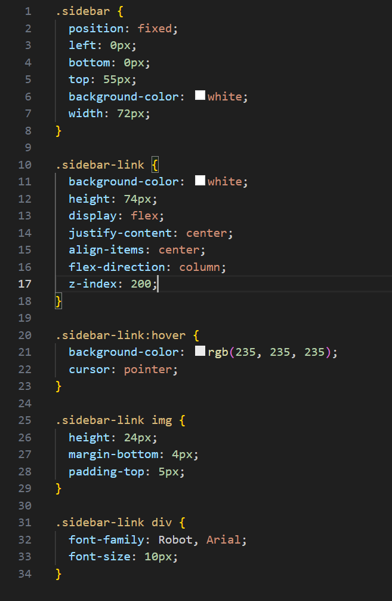
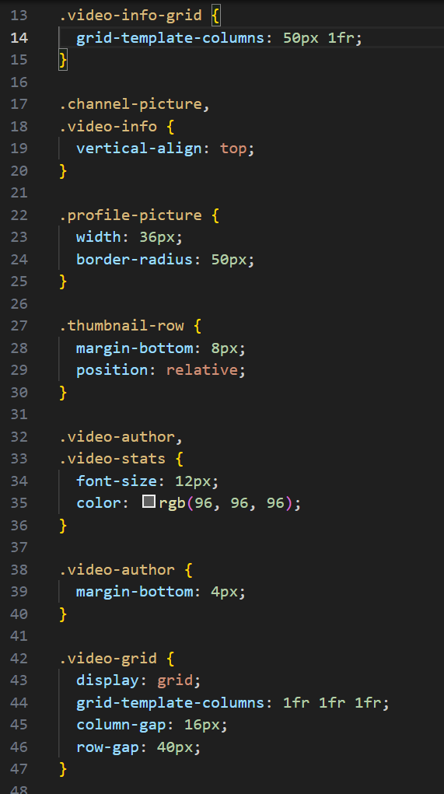
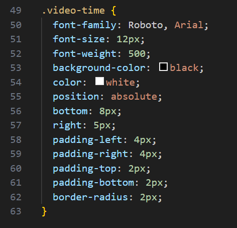
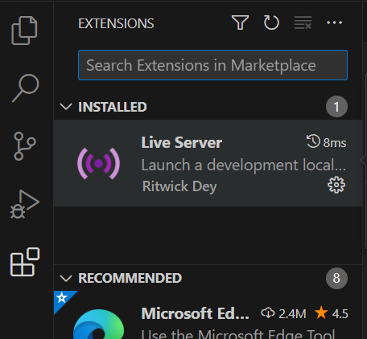

# YouTube Mock Website

The website uses HTML and CSS and is designed to copy the official YouTube website homepage. 

This website exists to test my ability to use my frontend skills and be able to take a design and export it on a webpage.

The technical concepts this project supports is the uses of divs, grids, and flexboxes to get the video display, side bar, and top bar to display like how it does on the official YouTube homepage. It also focuses on the different position properties of fixed, relative, and absolute and how using these types of positions affects the layout of a webpage.

## Core Technical Concepts

This project demonstrates how to use divs to separate different sections of a page like the header section and use flexboxes and grids to display information like the video information below each video thumbnail.

The header of the homepage is separated into three mini sections; the left, the middle, and the right. Each section is set to have a flex display. The header is set to fixed because I didn't want the header to be moved or altered by another element on the webpage. Setting the header to be a flex display with space-between allows the three mini sections inside the header to be evenly spaced no matter how much content is in each mini section. The z-index is set to 100 so that the header overlaps the content below the webpage so even if the user scrolls down the page, the header will still stay visible on the page. 

For the left section of the header, it is set to flex and align-items: center for the hamburger menu and the YouTube logo to display in the middle of the section. 

The middle section of the header has a flex display with a flex of 1. The flex is set to 1 because I wanted the section to take up as much space as possible up to where the right section begins. 

The right section has a display of flex and space between to have all the icons have equal spacing between them. The section has a flex-shrink: 0 to prevent the section from shrinking no matter what size the browser gets. The notifications icon's container is made relative to the notifications icon count which is absolute. The container is made relative to not affect the other elements in the header div, but the notifications icon count is made absolute because I didn't want a gap to be present while moving the icon count. Also, I wanted the icon count to be at the top right based on the parent element which is the icon container.

The containers for the icons and the voice search button in the right section of the header div is set to relative and set to center. The position is set to relative so that moving these elements will not change the layout around them. The tooltips for these icons and the voice search button are set to absolute positions. Since the tooltips (text that shows up below the icons when you hover over them) are dependent on the icons and button themselves, the tooltips are made absolute and positioned at the bottom. Since this only happens when you hover over the icons and button, the opacity is made 0 and made 1 in the hover states.

The sidebar is fixed so that the sidebar doesn't get moved if the user scrolls up or down the webpage. Each link in the sidebar is set to flex and is centered. The flex-direction is set to column since we want the links to be positioned one below the other and not side by side. The z-index is set to 200 so that the sidebar will always be in front of the webpage. 

The video layout is setup as a grid display with three columns all taking up equal free space. Column and row gaps are setup to separate each video to have clear visibility for the user.

The video information is set up as a grid below the video thumbnail with two columns. One column has a width of 50 pixels and the other has 1 free space since I wanted the column to take up the rest of the space. The thumbnail is set to have its own row with a position of relative since I didn't want the thumbnail row to affect the surrounding layout.

The video time is made absolute since I wanted the time to be over each thumbnail at the bottom right.

## Getting Started/Requirements

To run this website, download the code from [github.com/JCV2022/About-Me-Website](https://github.com/JCV2022/About-Me-Website)

A code editor program is needed. Any should do fine, I used Visual Studio Code to code my website.

If you do use Visual Studio Code as your code editor, install the extension Live Server to be able to run the code in real-time.

## Todo

Make the thumbnails lead to the actual videos on the real YouTube website when clicked and the channel names and channel pictures lead to the uploader's actual channel on the real YouTube website. 

## Contact Info

My email address is vujonathan00@gmail.com

My github is github.com/JCV2022

My linkedIn is linkedin.com/in/jonathan-vu-409a71132/
